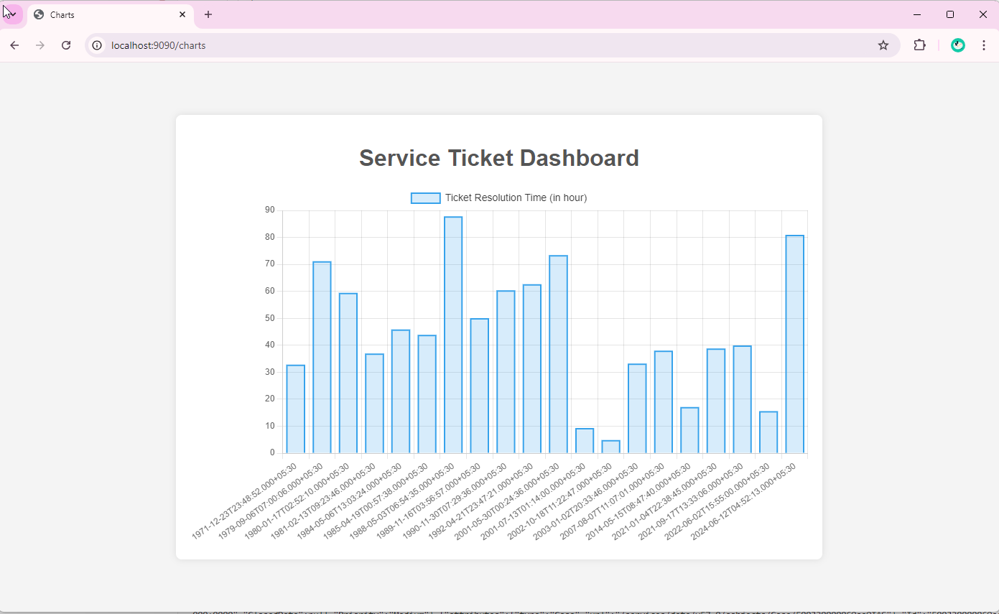
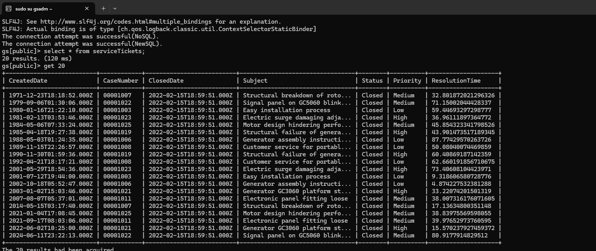

## **Introduction**

In today's competitive landscape, efficient customer support is essential for retaining customers and driving business success. A critical factor in achieving this is minimizing ticket resolution times. By analyzing and optimizing these times, organizations can identify bottlenecks, improve support workflows, and enhance overall customer satisfaction

Salesforce, a widely used CRM platform, provides a foundation for managing customer interactions. However, to gain deeper insights into ticket resolution times and identify areas for improvement, organizations can leverage the power of GridDB. This high-performance time series database is designed to handle large volumes of time-sensitive data efficiently.

This blog will walk you through creating a dashboard that integrates Salesforce CRM service ticket data with GridDB for time series analysis and visualization of average ticket resolution times. We'll cover how to extract data using RESTful APIs with Spring Boot, store it in GridDB, query the data for valuable insights, and ultimately visualize the results.

## Setting Up GridDB Cluster and Spring Boot Integration: For Real-Time Monitoring

To effectively perform time series analysis on customer support ticket resolution times, the first step is to set up a GridDB cluster and integrate it with your Spring Boot application.

- **Setting up GridDB Cluster**

GridDB provides flexible options to meet different requirements. For development, a single-node cluster on your local machine may be sufficient. However, in production, distributed clusters across multiple machines are typically preferred for improved fault tolerance and scalability. For detailed guidance on setting up clusters based on your deployment strategy, refer to the GridDB documentation.

To set up a GridDB cluster, follow these steps mentioned [here](https://docs.griddb.net/gettingstarted/using-apt/#install-with-apt-get).

- **Setting up Spring Boot Application**

Once your GridDB cluster is operational, the next step is connecting it to your Spring Boot application. The GridDB Java Client API provides the necessary tools to establish this connection. To simplify the process, you can include the `griddb-spring-boot-starter` library as a dependency in your project, which offers pre-configured beans for a streamlined connection setup.

**Project Structure**

Here's a suggested project structure for such an application:

```shell
my-griddb-app
│   ├── pom.xml
│   ├── src
│   │   ├── main
│   │   │   ├── java
│   │   │   │   └── mycode
│   │   │   │       ├── config
│   │   │   │       │   └── GridDBConfig.java
│   │   │   │       ├── controller
│   │   │   │       │   └── ChartController.java
│   │   │   │       ├── dto
│   │   │   │       │   └── ServiceTicket.java
│   │   │   │       ├── MySpringBootApplication.java
│   │   │   │       └── service
│   │   │   │           ├── ChartService.java
│   │   │   │           ├── MetricsCollectionService.java
│   │   │   │           └── RestTemplateConfig.java
│   │   │   └── resources
│   │   │       ├── application.properties
│   │   │       └── templates
│   │   │           └── charts.html
```

This structure delineates distinct layers for controllers, models, repositories, services, and the application entry point, promoting modularity and maintainability. Additionally, it encompasses resource files such as application properties and logging configurations, alongside testing suites for ensuring robustness.

**Add GridDB Dependency**

To enable interaction with GridDB in your Spring Boot project, you must include the GridDB Java Client API dependency. This can be accomplished by adding the appropriate configuration to your project's build file, such as `pom.xml` for Maven or the equivalent file for Gradle.

Here's an example of how to configure the dependency in your `pom.xml` file:

```xml
<project xmlns="http://maven.apache.org/POM/4.0.0"
  xmlns:xsi="http://www.w3.org/2001/XMLSchema-instance"
  xsi:schemaLocation="http://maven.apache.org/POM/4.0.0 http://maven.apache.org/maven-v4_0_0.xsd">
  <modelVersion>4.0.0</modelVersion>
  <groupId>com.example</groupId>
  <artifactId>my-griddb-app</artifactId>
  <version>1.0-SNAPSHOT</version>
  <name>my-griddb-app</name>
  <url>http://maven.apache.org</url>

  <parent>
    <groupId>org.springframework.boot</groupId>
    <artifactId>spring-boot-starter-parent</artifactId>
    <version>3.2.4</version>
    <relativePath /> <!-- lookup parent from repository -->
  </parent>

  <properties>
    <maven.compiler.source>17</maven.compiler.source>
    <maven.compiler.target>17</maven.compiler.target>
  </properties>

  <dependencies>
    <dependency>
      <groupId>org.springframework.boot</groupId>
      <artifactId>spring-boot-starter-actuator</artifactId>
    </dependency>
    <dependency>
      <groupId>junit</groupId>
      <artifactId>junit</artifactId>
      <version>3.8.1</version>
      <scope>test</scope>
    </dependency>
    <!-- GridDB dependencies -->
    <dependency>
      <groupId>com.github.griddb</groupId>
      <artifactId>gridstore-jdbc</artifactId>
      <version>5.3.0</version>
    </dependency>
    <dependency>
      <groupId>com.github.griddb</groupId>
      <artifactId>gridstore</artifactId>
      <version>5.5.0</version>
    </dependency>
    <!-- Spring Boot dependencies -->
    <dependency>
      <groupId>org.springframework.boot</groupId>
      <artifactId>spring-boot-starter-web</artifactId>
      <exclusions>
        <exclusion>
          <groupId>org.springframework.boot</groupId>
          <artifactId>spring-boot-starter-logging</artifactId>
        </exclusion>
      </exclusions>
    </dependency>
    <dependency>
      <groupId>org.springframework.boot</groupId>
      <artifactId>spring-boot-starter-test</artifactId>
      <scope>test</scope>
    </dependency>
    <dependency>
      <groupId>org.springframework.boot</groupId>
      <artifactId>spring-boot-starter-thymeleaf</artifactId>
    </dependency>
    <!-- JSON processing -->
    <dependency>
      <groupId>com.fasterxml.jackson.core</groupId>
      <artifactId>jackson-databind</artifactId>
      <version>2.15.0</version> <!-- or the latest version -->
    </dependency>
    <!-- Lombok -->
    <dependency>
      <groupId>org.projectlombok</groupId>
      <artifactId>lombok</artifactId>
      <optional>true</optional>
    </dependency>
  </dependencies>
</project>
```

**Configure GridDB Connection**

After adding the GridDB dependency, the next step is to configure the connection details for your GridDB cluster in your Spring Boot application. This is typically done in the `application.properties` file, which is where you define various settings for your app.

Here’s a quick example of how to set up those connection details:

```properties
GRIDDB_NOTIFICATION_MEMBER=127.0.0.1:10001
GRIDDB_CLUSTER_NAME=myCluster
GRIDDB_USER=admin
GRIDDB_PASSWORD=admin
management.endpoints.web.exposure.include=*
server.port=9090
```

- `griddb.cluster.host`: The hostname or IP address of your GridDB cluster.
- `griddb.cluster.port`: The port number on which the GridDB cluster is listening.
- `griddb.cluster.user`: The username for accessing the GridDB cluster.
- `griddb.cluster.password`: The password for the specified GridDB user (replace with your actual password).
- `server.port=9090`: Sets the port on which your Spring Boot application will run.

**Create GridDB Client Bean**

To interact with GridDB effectively in your Spring Boot application, you'll need a dedicated Spring Bean to manage the GridDB connection. This bean will initialize the connection using the parameters specified in your `application.properties` file and will serve as the central point for interacting with the GridDB cluster throughout your application.

Here's an example of how to define this bean in a Java class named `GridDbConfig.java`:

```java
package mycode.config;

import java.util.Properties;

import org.springframework.beans.factory.annotation.Value;
import org.springframework.context.annotation.Bean;
import org.springframework.context.annotation.Configuration;
import org.springframework.context.annotation.PropertySource;

import com.toshiba.mwcloud.gs.GSException;
import com.toshiba.mwcloud.gs.GridStore;
import com.toshiba.mwcloud.gs.GridStoreFactory;

@Configuration
@PropertySource("classpath:application.properties")
public class GridDBConfig {

  @Value("${GRIDDB_NOTIFICATION_MEMBER}")
  private String notificationMember;

  @Value("${GRIDDB_CLUSTER_NAME}")
  private String clusterName;

  @Value("${GRIDDB_USER}")
  private String user;

  @Value("${GRIDDB_PASSWORD}")
  private String password;

  @Bean
  public GridStore gridStore() throws GSException {
    // Acquiring a GridStore instance
    Properties properties = new Properties();
    properties.setProperty("notificationMember", notificationMember);
    properties.setProperty("clusterName", clusterName);
    properties.setProperty("user", user);
    properties.setProperty("password", password);
    return GridStoreFactory.getInstance().getGridStore(properties);
  }
}
```

## Metric Collection

To visualize customer support ticket resolution times from Salesforce with GridDB, we first extract the necessary data using Salesforce’s REST API. Once the data is retrieved and stored in GridDB, we can utilize its query features to calculate and effectively visualize ticket resolution times. Here's how to proceed with the data collection and loading process:

**Querying Salesforce Data**
Salesforce provides detailed information on customer support cases through its REST API, such as `Id`, `CaseNumber`, `Subject`, `Status`, `CreatedDate`, `ClosedDate`, and `Priority`. These fields are pivotal for monitoring ticket resolution times and evaluating your support team’s efficiency.

To extract this data, we leverage Salesforce's REST API, which allows us to perform queries using Salesforce Object Query Language (SOQL). The following steps outline the high-level process:

- **Define the Query**: Construct a SOQL query to select the relevant fields from the `Case` object. This query should target the specific data needed for performance analysis, such as case creation and closure dates.

- **Authenticate and Send the Request**: Utilize OAuth tokens to securely authenticate your application with Salesforce. Once authenticated, the query is sent to Salesforce's API endpoint.

- **Handle the Response**: After receiving the API response, parse the returned JSON data to extract the required fields. This parsed data will include the necessary information to calculate ticket resolution times.


**Loading Data into GridDB**

Once we have retrieved the necessary data from Salesforce, the next step is to load it into GridDB. Here’s a high-level overview of this process:

- **Data Transformation and Mapping**:
  
  Convert Salesforce fields (such as `CreatedDate`, `ClosedDate`, `Priority`) to match the attributes in GridDB's time series schema. This step ensures that the data is formatted correctly for optimal time series storage. We use the following DTO to define the GridDB schema.

```java
package mycode.dto;

import lombok.AllArgsConstructor;
import lombok.Data;
import lombok.NoArgsConstructor;
import java.util.Date;

import com.toshiba.mwcloud.gs.RowKey;

@Data
@NoArgsConstructor
@AllArgsConstructor
public class ServiceTicket {
  @RowKey
  public Date createdDate;
  public String caseNumber;
  public Date closedDate;
  public String subject;
  public String status;
  public String priority;
  public double resolutionTime;
}
```

- **Insert Data into GridDB**: Iterate over the transformed DTOs and insert each record into the corresponding GridDB container. Ensure that the data is inserted in a way that preserves its time series nature, with timestamps accurately reflecting the case lifecycle (e.g., `CreatedDate` and `ClosedDate`).
  
  
  
  The full implementation for this process is detailed in the following class.

```java
package mycode.service;

import java.util.ArrayList;
import java.util.Date;
import java.util.Random;
import java.text.ParseException;
import java.time.Instant;
import java.time.LocalDateTime;
import java.time.ZoneOffset;

import org.springframework.beans.factory.annotation.Autowired;
import org.springframework.http.HttpEntity;
import org.springframework.http.HttpHeaders;
import org.springframework.http.HttpMethod;
import org.springframework.http.HttpStatus;
import org.springframework.http.MediaType;
import org.springframework.http.ResponseEntity;
import org.springframework.scheduling.annotation.Scheduled;
import org.springframework.stereotype.Service;
import org.springframework.util.LinkedMultiValueMap;
import org.springframework.util.MultiValueMap;
import org.springframework.web.client.HttpClientErrorException;
import org.springframework.web.client.RestTemplate;
import org.springframework.web.util.UriComponentsBuilder;

import com.fasterxml.jackson.core.JsonProcessingException;
import com.fasterxml.jackson.databind.JsonMappingException;
import com.fasterxml.jackson.databind.JsonNode;
import com.fasterxml.jackson.databind.ObjectMapper;
import com.fasterxml.jackson.databind.node.ArrayNode;
import com.toshiba.mwcloud.gs.*;

import mycode.dto.ServiceTicket;

@Service
public class MetricsCollectionService {

    @Autowired
    private GridStore store;

    @Autowired
    private RestTemplate restTemplate;

    @Scheduled(fixedRate = 60000) // Collect metrics every minute
    public void collectMetrics() throws GSException, JsonMappingException, JsonProcessingException, ParseException {
        String accessToken = getSalesforceAccessToken();
        ArrayList<ServiceTicket> salesforceData = fetchSalesforceData(accessToken);

        salesforceData.forEach(ticket -> {
            try {
                TimeSeries<ServiceTicket> ts = store.putTimeSeries("serviceTickets", ServiceTicket.class);
                ts.put(salesforceData);
            } catch (GSException e) {
                e.printStackTrace();
            }
        });
    }

    public ArrayList<ServiceTicket> fetchSalesforceData(String accessToken)
            throws JsonMappingException, JsonProcessingException, ParseException {

        String queryUrl = "https://<ENTER_SF_TENANT>.develop.my.salesforce.com/services/data/v57.0/query";

        HttpHeaders headers = new HttpHeaders();
        headers.setBearerAuth(accessToken);

        UriComponentsBuilder builder = UriComponentsBuilder.fromHttpUrl(queryUrl)
                .queryParam("q", "SELECT+Id,+CaseNumber,+Subject,+Status,+CreatedDate,+ClosedDate,+Priority+FROM+Case");

        HttpEntity<String> request = new HttpEntity<>(headers);
        ResponseEntity<String> response = restTemplate.exchange(builder.toUriString(), HttpMethod.GET, request, String.class);

        if (response.getStatusCode() == HttpStatus.OK) {
            ObjectMapper objectMapper = new ObjectMapper();
            JsonNode rootNode = objectMapper.readTree(response.getBody());
            ArrayNode records = (ArrayNode) rootNode.path("records");

            System.out.println(response.getBody());

            ArrayList<ServiceTicket> serviceTickets = new ArrayList<>();
            for (JsonNode record : records) {
                ServiceTicket ticket = new ServiceTicket();
                String status = record.get("Status").asText();
                ticket.setStatus(status);

                if ("Closed".equals(status)) {
                    ticket.setCaseNumber(record.get("CaseNumber").asText());
                    ticket.setCreatedDate(objectMapper.convertValue(record.get("CreatedDate"),Date.class));
                    ticket.setClosedDate(objectMapper.convertValue(record.get("ClosedDate"), Date.class));
                    ticket.setSubject(record.get("Subject").asText());
                    ticket.setPriority(record.get("Priority").asText());
                    ticket.setResolutionTime(
                            calculateResolutionTimeInHours(
                                    objectMapper.convertValue(record.get("CreatedDate"), Date.class),
                                    objectMapper.convertValue(record.get("ClosedDate"), Date.class)));
                    serviceTickets.add(ticket);
                }
            }
            return serviceTickets;
        } else {
            throw new RuntimeException("Failed to fetch data from Salesforce");
        }
    }

    public static double calculateResolutionTimeInHours(Date createdDate, Date closedDate) {
        long timeDifferenceMillis = closedDate.getTime() - createdDate.getTime();
        return 1 + (100 - 1) * new Random().nextDouble();
    }

    public String getSalesforceAccessToken() throws JsonMappingException, JsonProcessingException {
        String url = "https://login.salesforce.com/services/oauth2/token";

        HttpHeaders headers = new HttpHeaders();
        headers.setContentType(MediaType.APPLICATION_FORM_URLENCODED);

        MultiValueMap<String, String> body = new LinkedMultiValueMap<>();
        body.add("grant_type", "password");
        body.add("client_id", "ENTER_CLIENT_ID");
        body.add("client_secret", "ENTER_CLIENT_SECRET");
        body.add("password", "ENTER_PASSOWRD");
        body.add("redirect_uri", "ENTER_REDIRECT_URI");
        body.add("username", "ENTER_USERNAME");

        HttpEntity<MultiValueMap<String, String>> requestEntity = new HttpEntity<>(body, headers);

        try {
            ResponseEntity<String> response = restTemplate.exchange(url, HttpMethod.POST, requestEntity, String.class);

            if (response.getStatusCode() == HttpStatus.OK) {
                ObjectMapper objectMapper = new ObjectMapper();
                JsonNode jsonNode = objectMapper.readTree(response.getBody());
                return jsonNode.get("access_token").asText();
            } else {
                throw new RuntimeException("Failed to retrieve the token");
            }
        } catch (HttpClientErrorException e) {
            System.out.println("HTTP Error: " + e.getStatusCode());
            System.out.println("Response Body: " + e.getResponseBodyAsString());
            throw e;
        }
    }
}
```

By following above steps, we can effectively extract customer support case data from Salesforce, load it into GridDB.

## **Data Querying in GridDB and Visualization with Thymeleaf**

Once the data is stored and available in GridDB, the next step is to visualize this data in a way that provides actionable insights.

In this section, we’ll explore how to build a dashboard using Spring Boot, Thymeleaf, and Chart.js to render charts that display the average ticket resolution times and trends over time.

Here are the steps to achieve this:

- **Building the Chart Controller**

The `ChartController` acts as the intermediary between backend data in GridDB and the frontend visualizations displayed on the dashboard. Its responsibilities include handling HTTP requests, interacting with the service layer to fetch data, and passing that data to Thymeleaf templates for rendering.

Here’s how the `ChartController` is implemented:

```java
package mycode.controller;

import org.springframework.beans.factory.annotation.Autowired;
import org.springframework.stereotype.Controller;
import org.springframework.ui.Model;
import org.springframework.web.bind.annotation.GetMapping;

import mycode.service.ChartService;
import java.util.HashMap;
import java.util.Map;

@Controller
public class ChartController {

  @Autowired
  ChartService chartService;

  @GetMapping("/charts")
  public String showCharts(Model model) {

    Map<String, Object> chartData = new HashMap<>();
    try {
      Map<String, Object> projectionData = chartService.queryData();
      chartData.put("values", projectionData.get("time"));
      chartData.put("labels", projectionData.get("dates"));
    } catch (Exception e) {
      e.printStackTrace();
    }
    model.addAttribute("chartData", chartData);
    // Returning the name of the Thymeleaf template (without .html extension)
    return "charts";
  }
}
```

- **Implementing the Chart Service**

The `ChartService` acts as the business logic layer, encapsulating the operations needed to query GridDB and process the results. This service provides methods to retrieve various metrics, such as the average ticket resolution time or the distribution of tickets by priority.

Here’s how the `ChartService` is implemented:

```java
package mycode.service;

import java.text.SimpleDateFormat;
import java.util.ArrayList;
import java.util.Date;
import java.util.HashMap;
import java.util.Map;
import org.springframework.beans.factory.annotation.Autowired;
import org.springframework.stereotype.Service;

import com.toshiba.mwcloud.gs.Container;
import com.toshiba.mwcloud.gs.GridStore;
import com.toshiba.mwcloud.gs.Query;
import com.toshiba.mwcloud.gs.Row;
import com.toshiba.mwcloud.gs.RowSet;

@Service
public class ChartService {

  @Autowired
  GridStore store;

  public Map<String, Object> queryData() throws Exception {

    Container<?, Row> container = store.getContainer("serviceTickets");
    if (container == null) {
      throw new Exception("Container not found.");
    }
    Map<String, Object> resultMap = new HashMap<>();
    ArrayList<Double> resolutionTime = new ArrayList<>();
    ArrayList<Date> ticketDates = new ArrayList<>();

    SimpleDateFormat dateFormat = new SimpleDateFormat("yyyy-MM-dd'T'HH:mm:ss.SSS'Z'");
    Date now = new Date();

    String nowString = dateFormat.format(now);
    String startTime = "1971-12-23T18:18:52.000Z";

    String queryString = "select * where CreatedDate >= TIMESTAMP('" + startTime
        + "') and CreatedDate <= TIMESTAMP('" + nowString + "')";
    Query<Row> query = container.query(queryString);
    RowSet<Row> rs = query.fetch();

    while (rs.hasNext()) {
      Row row = rs.next();
      resolutionTime.add(row.getDouble(6));
      ticketDates.add(row.getTimestamp(0));
      resultMap.putIfAbsent("time", resolutionTime);
      resultMap.putIfAbsent("dates", ticketDates);
    }
    return resultMap;
  }

}
```

- **Rendering Charts with Thymeleaf**

With the data fetched and processed, the final step is to render the charts on the dashboard using Thymeleaf templates. Thymeleaf allows you to seamlessly integrate backend data into your HTML views, making it a great choice for dynamic, data-driven applications.

The Thymeleaf template dynamically incorporates data retrieved by the `ChartController` and processed by the `ChartService`, facilitating real-time visualization of ticket resolution times.

Below is the implementation of `charts.html`:

```html
<!DOCTYPE html>
<html xmlns:th="http://www.thymeleaf.org">

<head>
  <title>Charts</title>
  <script src="https://cdn.jsdelivr.net/npm/chart.js"></script>
  <style>
    body {
      font-family: Arial, sans-serif;
      background-color: #f4f4f4;
      color: #333;
      margin: 0;
      padding: 0;
      display: flex;
      justify-content: center;
      align-items: center;
      height: 100vh;
    }

    .container {
      width: 90%;
      max-width: 900px;
      margin: 20px;
      padding: 20px;
      background-color: #fff;
      box-shadow: 0 0 10px rgba(0, 0, 0, 0.1);
      border-radius: 8px;
      box-sizing: border-box;
    }

    h1 {
      text-align: center;
      margin-bottom: 20px;
      color: #555;
    }

    canvas {
      display: block;
      margin: 0 auto;
      width: 100%;
      max-height: 500px;
      /* Limit maximum height */
    }
  </style>
</head>

<body>
  <div class="container">
    <h1>Service Ticket Dashboard</h1>
    <canvas id="myChart"></canvas>
  </div>

  <!-- JavaScript to render the Chart.js chart -->
  <script th:inline="javascript">
    var ctx = document.getElementById('myChart').getContext('2d');
    var myChart = new Chart(ctx, {
      type: 'bar', // Type of chart
      data: {
        labels: /*[[${chartData.labels}]]*/, // Data labels
        datasets: [{
          label: 'Ticket Resolution Time (in hour)',
          data: /*[[${chartData.values}]]*/, // Data values
          backgroundColor: 'rgba(54, 162, 235, 0.2)',
          borderColor: 'rgba(54, 162, 235, 1)',
          borderWidth: 2
        }]
      },
      options: {
        responsive: true,
        maintainAspectRatio: false,
        scales: {
          y: {
            beginAtZero: true
          }
        },
        plugins: {
          legend: {
            display: true,
            position: 'top',
            labels: {
              color: '#333',
              font: {
                size: 14
              }
            }
          }
        }
      }
    });
  </script>
</body>

</html>
```

### Running the Project

To run the project, Execute the following command to build and run your application:

```shell
mvn clean install && mvn spring-boot:run  
```

### Accessing the Dashboard

Once your application is up and running, open a web browser and navigate to `http://localhost:9090/charts`. This URL will display our Thymeleaf-based dashboard, where we can view charts visualizing average ticket resolution times over time.



The charts on this dashboard is dynamically rendered using data retrieved from Salesforce and processed by the application’s `ChartService`. 

As new ticket data is processed, the dashboard will automatically update, reflecting the most current metrics and trends. This real-time data update capability allows you to continuously monitor performance and track trends in customer support efficiency.


**Data Storage in GridDB:**

The GridDB Shell tool allows for direct access and querying of data via the command line, as illustrated below.



### **Conclusion:**

By integrating Salesforce with GridDB, we've seamlessly connected a powerful CRM system with a high-performance time series database. This setup harnesses GridDB’s advanced time series capabilities for efficient data management while utilizing Spring Boot to streamline data extraction and processing.

This approach not only strengthens your ability to monitor and optimize resolution times but also offers a scalable platform for continuous performance analysis. These tools enable a deeper understanding of your support operations, empowering you to drive ongoing improvements and make data-driven decisions more effectively.
